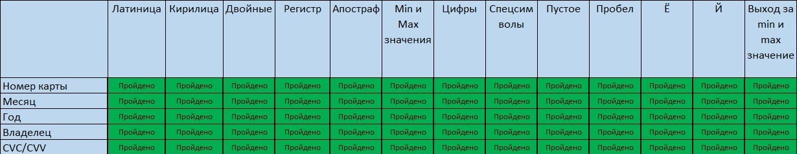
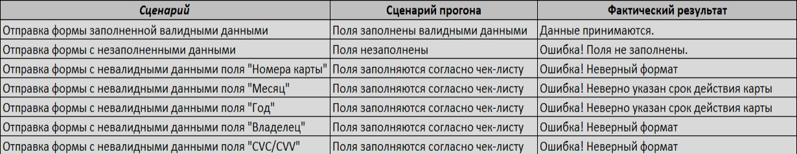
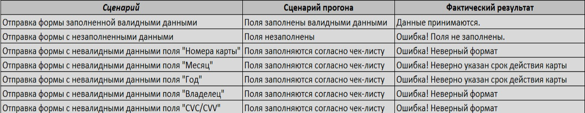

#### **Перечень автоматизируемых сценариев:**
1. Создать в IntelliJ IDEA новый проект на основе gradle.
2. Настроить тестовое окружение, подключить эмулятор с помощью Docker:
  - Эмулятор расположен в каталоге [gate-simulator](https://github.com/netology-code/qa-diploma/tree/master/gate-simulator).
  - Приложение расположено в файле [aqa-shop.jar](https://github.com/netology-code/qa-diploma/blob/master/aqa-shop.jar) на порту 8080.
  -  Учётные данные и URL для подключения задаются в файле [application.properties](https://github.com/netology-code/qa-diploma/blob/master/application.properties).
3. В терминале IntelliJ IDEA с помощью команды "_docker compose up_" запустить создание контейнера. 
4. В терминале IntelliJ IDEA с помощью команды "_java -jar ./artifacts/aqa-shop.jar_" запустить файл jar.
5. В браузере перейти на URL: http://localhost:8080

##### **Чек-лист**

##### **Отправка формы "Оплата по карте"**

##### **Отправка формы "Кредит по данным карты"**

#### **Перечень используемых инструментов с обоснованием выбора:**
1. IntelliJ IDEA - среда разработки для Java, имеет возможность подключения различных плагинов, зависимостей и библиотек необходимых для написания автотестов.
2. JDK 11 - комплект инструментов, необходимых для создания автотестов.
3. Git - система контроля версий, необходим для работы с GitHub.
4. Gradle - инструмент для подключения зависимостей и библиотек.
5. JUnit Jupiter - модуль позволяющий управлять тестированием через методы.
6. Lombok - библиотека для работы с кодом.
7. Selenide - это фреймворк для написания удобных для чтения и обслуживания автоматизированных тестов на Java.
8. Faker - библиотека генерации случайных данных.
9. Allure - фреймворк для создания отчетов о тестировании.
10. Docker -  это платформа, которая предназначена для разработки, развёртывания и запуска приложений в контейнерах.

#### **Перечень и описание возможных рисков при автоматизации:**
1. При настройке тестовой среды идет повышенный расход времени.
2. Автотесты могут потребовать доработки при изменений UI.
3. Вероятность возникновения "эффекта пестицидов".

#### **Интервальная оценка с учётом рисков в часах:**
1. Подготовка и настройка тестовой среды  - до 8 часов
2. Написание автотестов и прогон - до 24 часов
3. Время на устранение ошибок и непредвиденные ситуации - до 8 часов

#### **План сдачи работ:**
Время на настройку, создание и прогон автотестов до 17.11.2023г.
