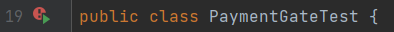

### **Автоматизация**

#### **Процедура запуска автотестов:**

Для запуска автотестов требуется установить ПО: 
  - [IntelliJ IDEA](https://www.jetbrains.com/idea/download/?section=windows)
  -  [Docker](https://github.com/netology-code/aqa-homeworks/blob/master/docker/installation.md)

  Приложение расположено в файле "_aqa-shop.jar_" и запускается стандартным способом "-java -jar aqa-shop.jar-" на порту 8080.

В файле application.properties приведён ряд типовых настроек:

  - учётные данные и URL для подключения к СУБД;
  - URL-адреса банковских сервисов.

СУБД

Заявлена поддержка двух СУБД:

  - MySQL;
  - PostgreSQL.

Учётные данные и URL для подключения задаются в файле application.properties.

Эмулятор написан на Node.js, для его запуска рекомендуется использовать Docker. Эмулятор расположен в каталоге [gate-simulator](https://github.com/netology-code/qa-diploma/tree/master/gate-simulator).

##### **Шаги:**
1. С помощью команды "_git clone_" клонировать репозиторий [TourPurchaseWebService](https://github.com/AMA17/TourPurchaseWebService).
2. Открыть клонированную папку в IntelliJ IDEA.
3. В терминале с помощью команды "_docker compose up_" запустить контейнеры в Docker.
4. В терминале  помощью команды "_java -jar ./artifacts/aqa-shop.jar_" запустить файл .jar.
5. Запустить автотесты. Для запуска тестов можно воспользоваться интерактивной кнопкой запуска рядом с тестом  либо запустить тесты с использованием Allure задав команды в терминале IntelliJ IDEA:
 - ./gradlew clean test
 - ./gradlew allureserve

