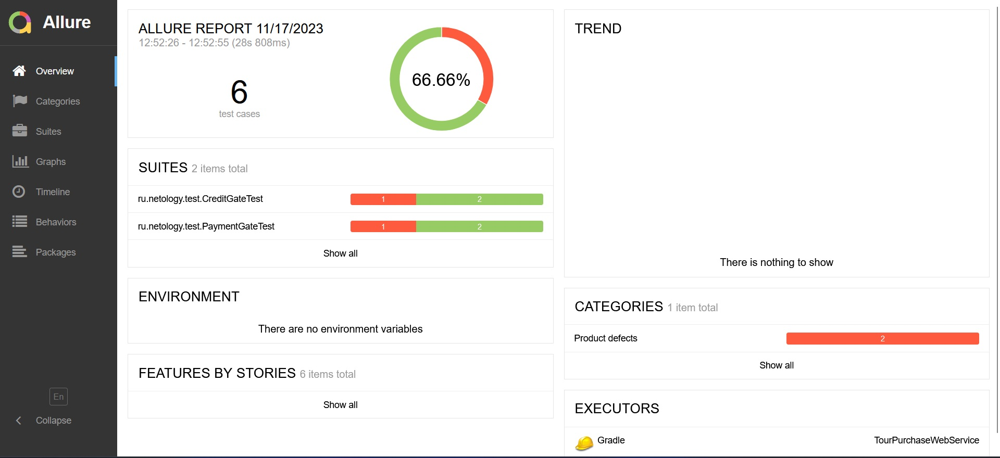
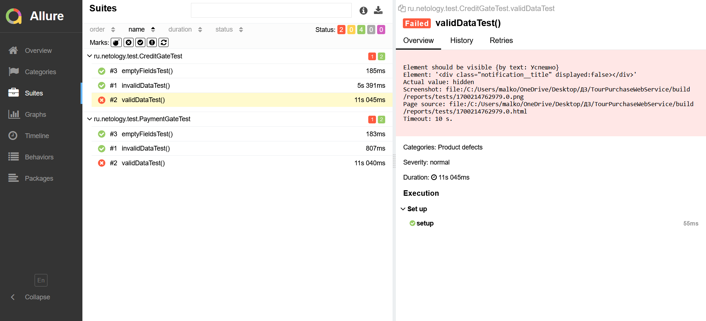

## **Отчётные документы по итогам тестирования**

#### **Отчёт о проведённом тестировании:**

В полях при заполнении карты для оплаты разделов "Купить" и "Купить в кредит" было проведено ручное тестирование полей, согласно чек-листу приложенному в файле README.md.
Данные поля отрабатывают корректно.

В разделе "Купить" было проведено 3 автотеста:
 1. Заполнение полей валидными значениями
 2. Заполнение одного из полей невалидным значением
 3. Не заполненные поля

В разделе "Купить в кредит" было проведено 3 автотеста:
 1. Заполнение полей валидными значениями
 2. Заполнение одного из полей невалидным значением
 3. Не заполненные поля

В разделе "Купить" и "Купить в кредит" тест на "Заполнение полей валидными значениями" не прошел, т.к. был выявлен баг в поле "Год", Issues оформлен в репозитории проекта. 

