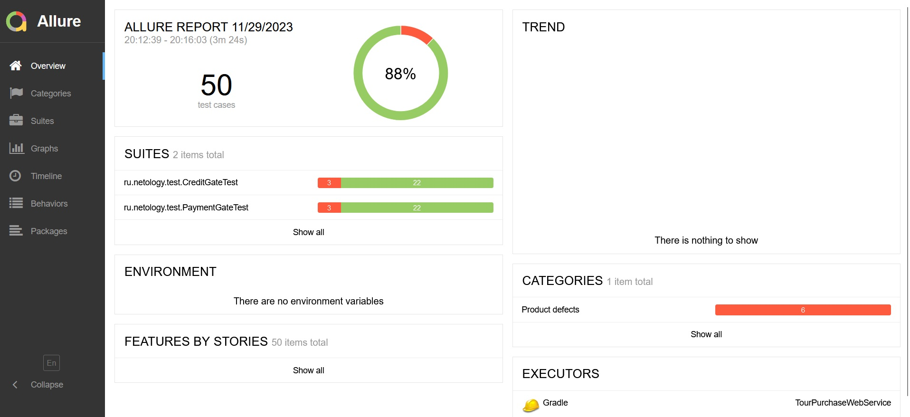
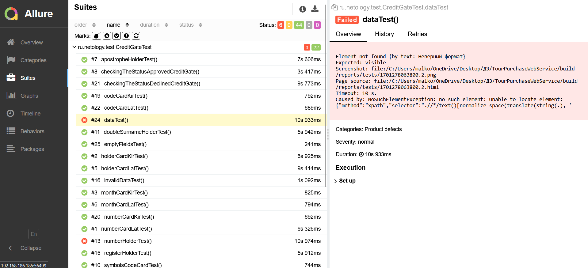

## **Отчётные документы по итогам тестирования**

#### **Отчёт о проведённом тестировании:**

В полях при заполнении карты для оплаты разделов "Купить" и "Купить в кредит" было проведено ручное тестирование полей, согласно чек-листу приложенному в файле README.md.
Данные поля отрабатывают корректно.

В разделе "Купить"и "Купить в кредит" было проведено по 25 автотестов согласно чек-листу приложенному в файле README.md..

Тесты "dataTest()" - Заполнение полей валидными значениями, "numberHolderTest()", "symbolsHolderCardTest()" - заполнение поля "Владелец" цифрами и спецсимволами не прошли, т.к. был выявлен баг, Issues оформлены в репозитории проекта. 

